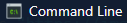

<h3 align="center">
  Welcome to ahmed hatem's profile!
  
</h3>

<!-- Typing SVG by DenverCoder1 - https://github.com/DenverCoder1/readme-typing-svg -->

  

 

- 🏢 I'm a Full-stack-web-developer
- 👨‍💻 Study management information systems and computer science,  constantly learning and exploring new technologies to improve my skills.
- 💬 Ask me about my experience with JavaScript, ReactJS, and php, or anything related to web development.
- ⚡ Fun Fact: I'm a coffee enthusiast and my perfect day would start and end with a cup of coffee.
- 👨‍💻 Check out my portfolio at https://ahmadhatem.com/ to see some of the projects I've worked on.

<h2>Connect with Me :</h2>

 

<h2 align="center">🔥 Languages & Frameworks & Tools & Abilities 🔥</h2>

&nbsp;
&nbsp;
&nbsp;
&nbsp;
&nbsp;
&nbsp;

&nbsp;
&nbsp;
&nbsp;
&nbsp;
&nbsp;

&nbsp;

  
     

 <h2 align="center">Code Cycle</h2>

&nbsp;&nbsp;&nbsp;&nbsp;&nbsp;

&nbsp;&nbsp;&nbsp;&nbsp;&nbsp;
 

<!--img src="https://github.com/SP-XD/SP-XD/blob/main/images/this_page_is.gif?raw=true"  width="40%"/-->
